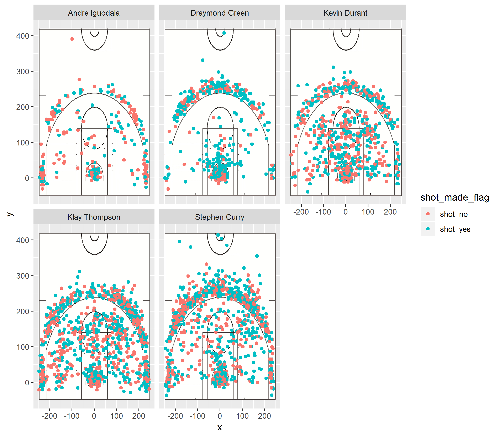

```{r setup, include=FALSE}
library(knitr)
library(dplyr)
read_chunk("../code/make-shots-data-script.R")
read_chunk("../code/make-shot-charts-script.R")
```

```{r make_shots_data, include = FALSE}
```

```{r make_shot_charts, include = FALSE}
```

In this report, we examine the effectiveness of some of the Golden State Warriors' shots during the 2016 season. WE focused on all of the shots taken by Andre Iguodala, Draymond Green, Kevin Durant, Klay THompson, and Stephen Curry. The players' shots were mapped onto a court diagram and analyzed for accuracy.

```{r out.width="90%", echo = FALSE, fig.align = "center"}

```

### 2PT Effective Shooting % by Player

```{r effective_shooting2, echo = FALSE}
eff_shoot_2pt <- shots_data
eff_shoot_2pt <- eff_shoot_2pt %>%
  filter(shot_type == "2PT Field Goal") %>%
  select(name, shot_made_flag) %>%
  group_by(name) %>%
  summarize(total = length(shot_made_flag), made = length(shot_made_flag[shot_made_flag == "shot_yes"]), perc_made = round(made/total, digits = 3)) %>%
  arrange(desc(perc_made))
kable(eff_shoot_2pt, caption = "2PT Effective Shooting % by Player")
```

### 3PT Effective Shooting % by Player

```{r effective_shooting3, echo = FALSE}
eff_shoot_3pt <- shots_data
eff_shoot_3pt <- eff_shoot_3pt %>%
  filter(shot_type == "3PT Field Goal") %>%
  select(name, shot_made_flag) %>%
  group_by(name) %>%
  summarize(total = length(shot_made_flag), made = length(shot_made_flag[shot_made_flag == "shot_yes"]), perc_made = round(made/total, digits = 3)) %>%
  arrange(desc(perc_made))
kable(eff_shoot_3pt, caption = "3PT Effective Shooting % by Player")
```

### Overall Effective Shooting % by Player

```{r effective_shooting, echo = FALSE}
eff_shoot <- shots_data
eff_shoot <- eff_shoot %>%
  select(name, shot_made_flag) %>%
  group_by(name) %>%
  summarize(total = length(shot_made_flag), made = length(shot_made_flag[shot_made_flag == "shot_yes"]), perc_made = round(made/total, digits = 3)) %>%
  arrange(desc(perc_made))
kable(eff_shoot, caption = "Overall Effective Shooting % by Player")
```
